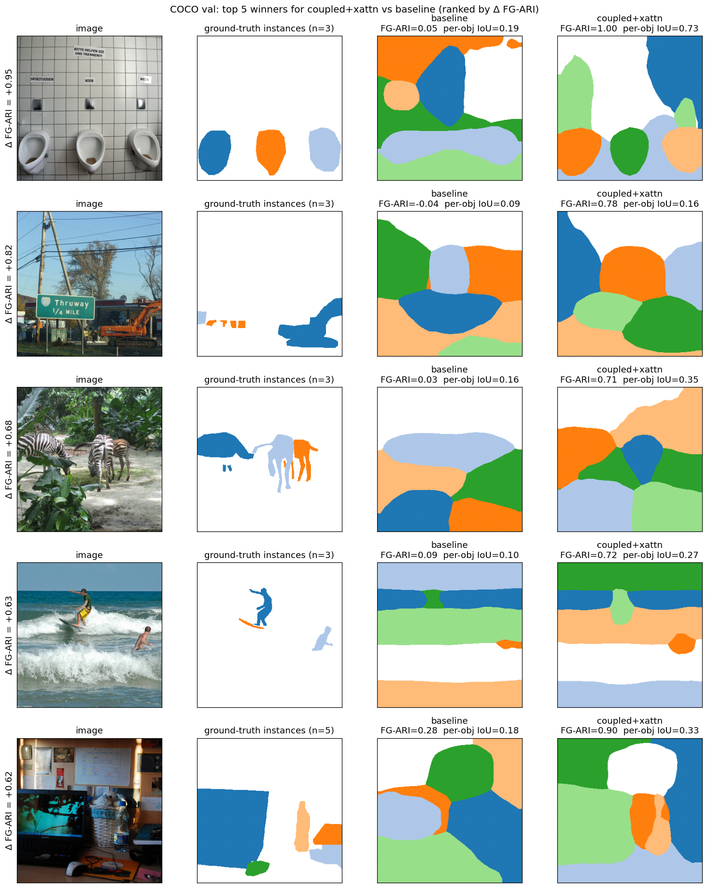

# DINO-TRM

A slot-attention object discovery model on top of frozen DINOv3 features. Trained
unsupervised to reconstruct the DINOv3 patch features as per DINOSAUR (Seitzer et al. 2023). This work adds a
recursive reasoning module over the slot vectors in the style of the Tiny Recursive
Model (TRM, Jolicoeur-Martineau et al. 2025); `coupled` additionally re-runs slot
attention each step, testing whether iteration helps separate touching or overlapping
objects that single-pass slot attention merges into one slot.

## What the model does, step by step

For a 336×336 image:

1. **Frozen DINOv3 ViT-S/16 backbone** (ViT = Vision Transformer). Outputs 441 patch
   features (a 21×21 grid, one per 16-px patch), each 384-dim. Runs in bfloat16 (bf16)
   under `no_grad`; no gradients flow into it. Source: `models/backbone.py`.
2. **Project to slot dim.** LayerNorm + Linear, 384 → 256.
3. **Slot Attention** (`models/slot_attention.py`). 7 slot vectors are sampled from a
   learned Gaussian. For 3 iterations, slots attend over the 441 patch features with a
   softmax that *competes across slots* (each patch is fought over) and each slot is
   updated by a GRU (gated recurrent unit). Output: 7 slot vectors (each 256-dim) plus
   a soft (7, 441) patch-to-slot assignment.
4. **Recursion.** `baseline` skips this; `trm` and `coupled` run an 8-step loop. See
   the three modes below.
5. **Spatial broadcast decoder** (`models/decoder.py`). Each slot vector is broadcast
   over a 21×21 grid, a learned positional code is added, and a 4-layer MLP
   (multi-layer perceptron) predicts a 384-dim reconstruction *and* an alpha-mask
   logit per patch. The output feature map is the alpha-weighted sum across slots.
6. **Loss.** Mean squared error between the reconstructed feature map and the original
   DINOv3 patch features. When recursion is active, the loss is applied at every step
   (deep supervision). The slots have to capture object structure to predict the
   feature map DINO produced.

The 7 alpha masks (upsampled to image resolution and argmaxed across slots) give a
per-pixel slot id, which is what we score against ground-truth segmentation.

## The three modes

All share the backbone, slot attention, decoder, and reconstruction loss. They differ
in what sits between slot attention and the decoder:

- **`baseline`**: nothing. Decode directly from the slot-attention output above
  (one invocation of the module, which itself runs the standard 3 internal
  attend-and-GRU iterations). This is the DINOSAUR baseline.
- **`trm`**: an 8-step recursion that refines the 7 slot vectors. Each step is a
  small pre-norm transformer (FFN = feed-forward network) over the 7 slot tokens
  (self-attention + FFN). With `model.gnn_cross_attn=true`, each step also includes a
  cross-attention layer where the slots re-read the 441 patch features (query =
  slots, key/value = patches), so the recursion isn't blind to the image after the
  initial binding. Full backpropagation through time (BPTT) across all 8 steps
  (`tests/test_recursion_grad.py` verifies this).
  Sources: `models/tiny_gnn.py`, `models/trm_module.py`.
- **`coupled`**: same as `trm`, plus at every recursion step slot attention is
  *re-run* on the patches, conditioned on the current slot vectors. So patches that
  were assigned to the "wrong" slot in iteration 1 can be re-assigned in iteration 2
  as the slot vectors refine. In TRM-paper terms, the recursion carries three streams
  over the 7 slot tokens — `x` (the perceptual evidence, the "question"), `y` (the
  current slot answer, refined each step), and `z` (a per-slot latent reasoning state
  carried across steps). In `trm`, `x` is held fixed at the initial binding and only
  `y`, `z` evolve; **`coupled` lifts `x` from a constant to a function of the prior
  latent**, `x_t = SlotAttention(patches, z_{t-1})`, so the reasoning state feeds
  back into perception each step rather than only the other way around. This is what
  the COCO experiments below show works on touching same-class objects.

Compute cost per training step roughly tracks the recursion depth: `baseline` is the
cheapest, `trm` and `coupled` with T=8 are ≈5× slower (full BPTT through 8 steps).

## Results

**Headline:** on an occlusion-rich COCO multi-object subset, patch-grounded reasoning
over slots gives a +2 mBO (mean Best Overlap, an Intersection-over-Union (IoU) based
mask quality score) / +4–5 FG-ARI (Foreground Adjusted Rand Index, a clustering-purity
grouping score) gain over baseline. Controls show the mBO gain is largely capacity, while the **foreground
grouping (FG-ARI) gain is the recursion's specific contribution** — exactly the metric
most aligned with the touching/overlapping regime the design targets.

The project was originally developed on PASCAL VOC and the recursive variants there
only beat the baseline by ~+1 mBO with no grouping signal at all. VOC is mostly
single-object scenes with clean separation — a regime where slot attention's initial
binding already does most of the work, leaving little for the recursion to fix. The
`coupled` top-down rebinding loop is designed for the opposite case: touching or
overlapping objects of the same class, where a single binding pass tends to merge
them into one slot. The COCO multi-object subset below exercises exactly that regime,
which is where the win actually shows up.

### COCO multi-object subset, 3-seed averaged, full 2k val, true instance masks

| Model | per-instance IoU (mBO_i) | per-class IoU (mBO_c) | foreground grouping (FG-ARI) | params |
|---|:--:|:--:|:--:|:--:|
| baseline | 22.9 ±0.1 | 28.6 ±0.1 | 42.5 ±0.2 | 3.9 M |
| **mlp_block + cross-attn** *(param control)* | 25.0 ±0.1 | **32.2 ±0.1** | 44.6 ±0.3 | **7.1 M** (+11 %) |
| **trm + cross-attn, T=1** *(recursion control)* | **25.7 ±0.0** | **32.8 ±0.0** | 45.9 ±0.0 | 6.4 M |
| trm + cross-attn (T=8) | 25.2 ±0.0 | 31.0 ±0.1 | 46.7 ±0.1 | 6.4 M |
| coupled + cross-attn (T=8) | 25.1 ±0.0 | 30.9 ±0.0 | **47.2 ±0.1** | 6.4 M |
| _DINOSAUR (full COCO, reported / reproduction)_ | _26.1 / 28.0_ | _30.0 / 31.7_ | _39.4 / 40.2_ | – |

Std ≈ 0, so every gap above is real. The two control rows disentangle what's driving
the gain:

- **`mlp_block`** swaps the recursive reasoner for a 3-block transformer stack (same
  `_Block` as TinyGNN, self-attn + slot→patch cross-attn + FFN, applied once, no
  recursion) — **+11 % more trainable parameters** than trm/coupled. Isolates raw
  capacity.
- **`trm + cross-attn, T=1`** runs the actual recursive module for a single step.
  Isolates the recursion specifically.

**On mBO_i** (mask-boundary alignment, IoU-based), `mlp_block` reaches **25.0** vs
trm's 25.2 — i.e. **91 % of trm's +2.3 gain over baseline is reproduced by just
adding non-recursive capacity in the same architectural slot**.

**On mBO_c the recursion *hurts*** (T=1 32.8 → T=8 31.0) while it *helps* FG-ARI.
This is consistent with the qualitative behaviour in
[`coupled_vs_baseline_winners.png`](results/coco/diagnostics/coupled_vs_baseline_winners.png) —
the recursion splits touching same-class objects (3 zebras → 3 slots), which improves
instance-level grouping (FG-ARI ↑) but loses against a per-class GT that pools all
instances of a class into one mask (mBO_c ↓). mBO_i sits in between because the
splitting effect goes in opposite directions on touching-same-class vs distinct-class
scenes and partly cancels across the val set. Read together, the three metrics
fingerprint *what* the recursion is doing: trading semantic-region match for
instance-level grouping.

**On FG-ARI** (grouping), each contribution adds incrementally: 42.5 → 44.6 (capacity)
→ 45.9 (the module itself) → 46.7 (recursion) → 47.2 (coupling). The 7.1 M-param
non-recursive control still trails the 6.4 M recursive run by 2.1 FG-ARI, so the
grouping win is not a capacity artefact. `coupled` sits above `trm` at every
recursion depth on FG-ARI (see
[`results/coco/fg_ari_vs_depth.png`](results/coco/fg_ari_vs_depth.png)).

Our COCO subset is curated multi-object, so the DINOSAUR reference row is a regime
check, not like-for-like.

### Qualitative: where the coupled feedback loop actually wins

The 5 COCO val images where `coupled + cross-attn` beats baseline most on the
foreground grouping score:



Pattern: scenes with a few similar / touching objects (3 urinals, 3 zebras, 2
surfers) that baseline collapses into one slot but coupled's per-step re-binding
splits, the regime the design is for. The figure is produced by
[`scripts/coupled_vs_baseline_visuals.py`](scripts/coupled_vs_baseline_visuals.py).

## Testing methodology

All numbers in the table above come from `src/dino_trm/eval_protocol.py`, which
follows the published DINOSAUR evaluation protocol so the reference rows are
comparable (modulo the subset caveat). For each validation image:

1. **Predicted masks → image resolution.** The model emits 7 soft alpha masks at the
   21×21 patch grid. They're bilinearly upsampled to 336×336, then a per-pixel
   `argmax` across slots gives a hard slot-id map. Evaluation happens at image
   resolution, not the coarse patch grid (`_upsample_pred`).
2. **Ground truth.** Void pixels (label 255) are folded into background (0), per the
   reference. COCO provides true instance masks (`inst_full`), used directly.

Three metrics are reported, all on the final recursion step:

- **mBO_i (per-instance mean Best Overlap).** For each ground-truth *instance*,
  take the maximum Intersection-over-Union (IoU) against any predicted slot mask;
  average those best IoUs over instances, then over images. Equivalent to "for each
  object, what's the slot that covers it best?" — a boundary-quality score.
- **mBO_c (per-class mean Best Overlap).** Same construction but matched against
  ground-truth *semantic classes* (all pixels of the same class pooled). Insensitive
  to instance splitting; rewards getting the semantic region right even if one slot
  covers multiple instances.
- **FG-ARI (Foreground Adjusted Rand Index).** Restrict to the foreground pixels
  (`inst != 0`) and compute the Adjusted Rand Index between the predicted slot ids
  and the ground-truth instance ids over those pixels. Measures whether pixels that
  belong to the same object end up in the same predicted slot — a *grouping* score
  that's largely independent of mask alignment to object boundaries.

In addition, `fg_ari_per_step` reports FG-ARI computed after each recursion step
(t = 1…8) for the depth curves in `results/coco/fg_ari_vs_depth.png` — same metric,
just using the intermediate slot states.

**Seed averaging.** Slot init is random per forward, so the protocol is stochastic.
`scripts/eval_published.py --seeds 3` runs the full eval 3× with seeds {0, 1, 2} and
reports mean ± std. Std ≈ 0 in the table means the reported gaps are far above
seed noise. Training itself is a single seed per checkpoint; the seed-averaging is
on evaluation alone (we have not yet seed-averaged training).

## Environment

PyTorch 2.11 + CUDA 12.8, Python 3.12, bf16 mixed precision throughout. Managed
with `uv`.

```bash
uv sync                                       # install
uv run python scripts/sanity_check.py         # backbone forward, prints shapes
uv run python -m pytest tests/ -q             # unit tests incl. full-BPTT grad check
```

DINOv3 is a gated Hugging Face model. You need access to
`facebook/dinov3-vits16-pretrain-lvd1689m` and a token with gated-repo read
permission. The backbone wrapper also supports `facebook/dinov2-small` as an open
fallback (set `model.model_id`); patch geometry is read from the backbone so the
rest of the pipeline adapts (DINOv2 → 256 patches, DINOv3 → 441 at 336²).

## Training and evaluation

```bash
# Build the COCO multi-object subset (25k train + 2k val; downloads only those JPGs)
uv run python scripts/build_coco_subset.py

# Train. Sequential ~14h on a single 16GB consumer GPU.
bash run_coco.sh             # baseline + trm/coupled with cross-attn, 30 epochs each
bash run_coco_controls.sh    # mlp_block (param control) + trm + cross-attn, T=1 (recursion control)

# Published-protocol eval + figures
uv run python scripts/eval_published.py --dataset coco        # seed-averaged
uv run python scripts/make_figures.py     --dataset coco      # depth curve + qualitative
```

Config lives in `configs/base.yaml` (Hydra). Slot init is random per forward, so the
published-protocol eval is stochastic; `eval_published.py` defaults to 3-seed
averaging. With T=8 recursion, gradients from the final step reach the learned latent
init `z0` only if BPTT is intact, which `tests/test_recursion_grad.py` verifies.

## Limitations

- **COCO subset, not full COCO.** Trained on a 25k multi-object subset (eval on 2k
  val) rather than the full ~118k train split, to keep total training time tractable
  on a single 16GB consumer GPU. The DINOSAUR row in the results table is full COCO,
  so it's a regime check, not a direct comparison.
- **Fixed-depth recursion (T=8).** Both `trm` and `coupled` run a hardcoded 8-step
  inner loop (`models/trm_module.py:82`, `configs/base.yaml:17`). The original TRM
  uses ACT (Adaptive Computation Time) halting so depth varies per sample at
  training time. The halting head and ACT loss are wired up here
  (`losses.act_halting_loss`, `loss.act_weight`) but kept at 0 in every reported run.
- **Recursion hurts mBO at T=8.** The controls revealed `trm @ T=1` beats `trm/coupled
  @ T=8` on mBO (25.7 vs 25.2). The fixed-depth recursion is over-iterating for the
  boundary-quality objective; ACT halting (below) is the obvious fix.

## Future work

- **Variable-depth training with ACT halting.** Enable the existing halting loss
  (`loss.act_weight>0`) so the model learns to stop early on easy scenes and recurse
  deeper on hard ones, matching the original TRM recipe. Plausibly cheaper at
  inference and a better fit for the touching-object cases where the recursion gain
  actually lives.
- **Full COCO** with the same recipe, once a longer training budget is available.
- **Occlusion benchmark** isolating the touching/overlapping-object regime where the
  recursion gain shows up.

## Layout

```
src/dino_trm/
  models/   backbone, slot_attention, decoder, tiny_gnn, trm_module, mlp_block, full_model
  data/     pascal_voc (labelled), voc_imageonly (15.6k unlabelled),
            coco (multi-object subset; returns true instance masks for eval)
  losses.py reconstruction + deep supervision + ACT halting + query orthogonality
  train.py  Hydra training loop with bf16 autocast + grad clip
  eval_protocol.py  full-resolution mBO_i / mBO_c / FG-ARI (uses true instances on COCO)
  utils/    logging, viz
configs/    base.yaml, pascal_voc.yaml
scripts/    build_train_index, build_coco_subset, sanity_check, download_data,
            eval_published, make_figures, coupled_vs_baseline_visuals,
            compare_matched, compare_models
tests/      slot_attention, tiny_gnn, recursion_grad (full-BPTT), mlp_block, losses
```
